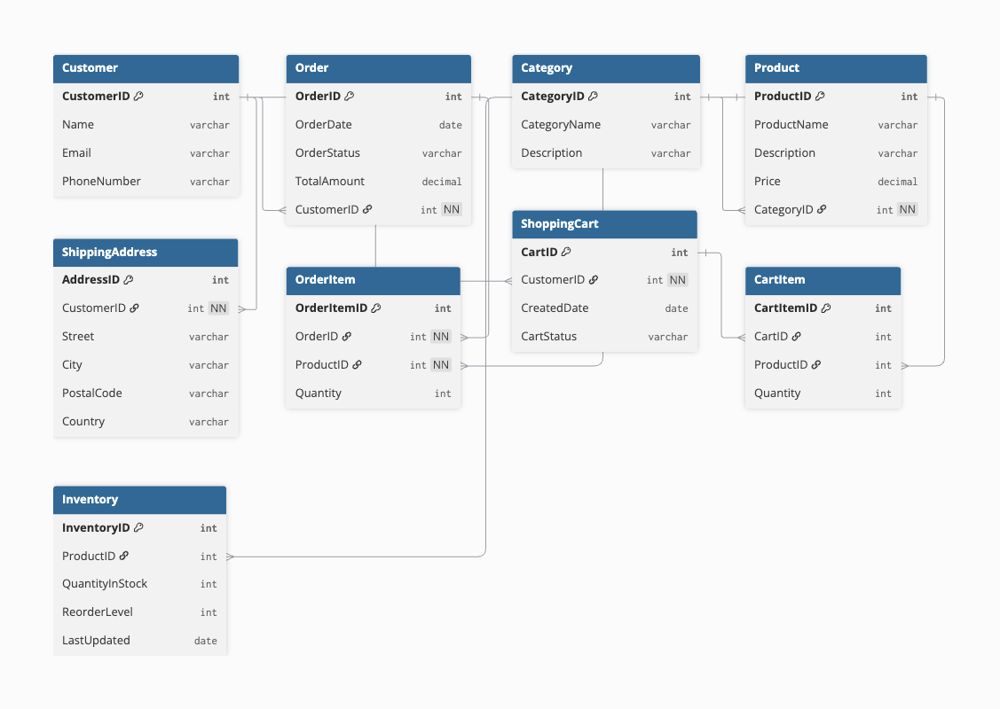

# E-Commerce Database Design

A relational database design for an e-commerce retail application.

## Project Overview

This project demonstrates the design of a relational database for an e-commerce application. The database models customers, orders, products, categories, shipping addresses, shopping carts, and inventory.

The design focuses on:

- Entity and attribute identification
- Primary and foreign keys
- Relationships and cardinality
- Many-to-many relationship resolution
- Entity-Relationship Diagram (ERD)
- Relational database structure

## Entity-Relationship Diagram

## Database Entities

The database currently includes:

- Customer
- Order
- OrderItem
- Product
- Category
- ShippingAddress
- ShoppingCart
- CartItem
- Inventory

## Schema

The database schema is represented using DBML and can be used to visualize the relationships between the tables.

## Concepts Demonstrated

- Primary Keys (PK)
- Foreign Keys (FK)
- One-to-Many (1:M) relationships
- Many-to-Many (M:N) relationships
- Entity-Relationship modeling
- Conceptual vs. physical database design

## Tools

- DBML
- dbdiagram.io
- GitHub

## Status

Initial database design completed. Future development will include SQL implementation, sample data, and database queries.
